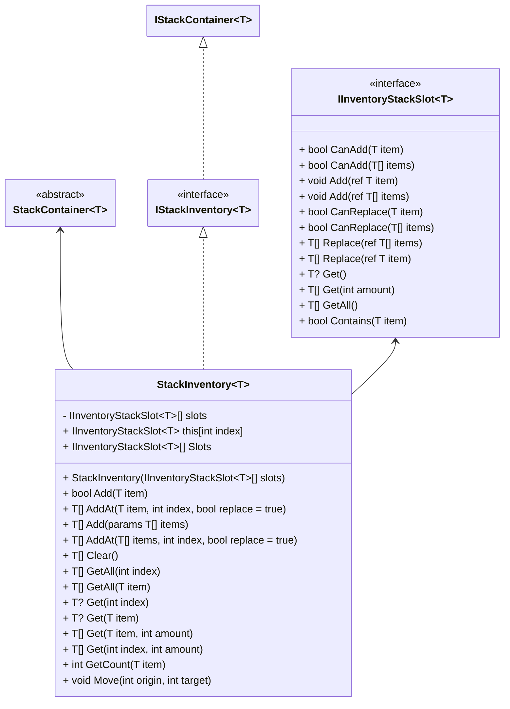

# Class Diagrams

This document contains class diagrams for the components of TheChest.Inventory project.

## IStackInventory Diagram

```mermaid
---
config:
  theme: mc
  look: classic
  class:
    hideEmptyMembersBox: true
---
classDiagram
direction BT

class StackInventory~T~ {
    - IInventoryStackSlot~T~[] slots
    + IInventoryStackSlot~T~ this[int index]
    + IInventoryStackSlot~T~[] Slots
    + StackInventory(IInventoryStackSlot~T~[] slots)
    + bool Add(T item)
    + T[] AddAt(T item, int index, bool replace = true)
    + T[] Add(params T[] items)
    + T[] AddAt(T[] items, int index, bool replace = true)
    + T[] Clear()
    + T[] GetAll(int index)
    + T[] GetAll(T item)
    + T? Get(int index)
    + T? Get(T item)
    + T[] Get(T item, int amount)
    + T[] Get(int index, int amount)
    + int GetCount(T item)
    + void Move(int origin, int target)
}

class StackContainer~T~ {
    <<abstract>>
}

class IStackInventory~T~ {
    <<interface>>
}

class IInventoryStackSlot~T~ {
    <<interface>>
    + bool CanAdd(T item)
    + bool CanAdd(T[] items)
    + void Add(ref T item)
    + void Add(ref T[] items)
    + bool CanReplace(T item)
    + bool CanReplace(T[] items)
    + T[] Replace(ref T[] items)
    + T[] Replace(ref T item)
    + T? Get()
    + T[] Get(int amount)
    + T[] GetAll()
    + bool Contains(T item)
}

StackInventory~T~ --> StackContainer~T~
StackInventory~T~ ..|> IStackInventory~T~
StackInventory~T~ --> IInventoryStackSlot~T~
IStackInventory~T~ ..|> IStackContainer~T~
```