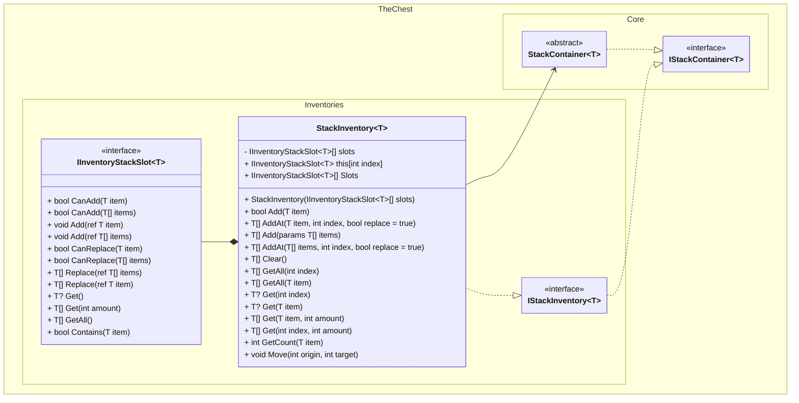

# Class Diagrams

This document contains class diagrams for the components of TheChest.Inventory project.

## IStackInventory Diagram
The `IStackInventory` diagram represents a generic container that holds and manages items in slots that can hold more than one amount of it.

