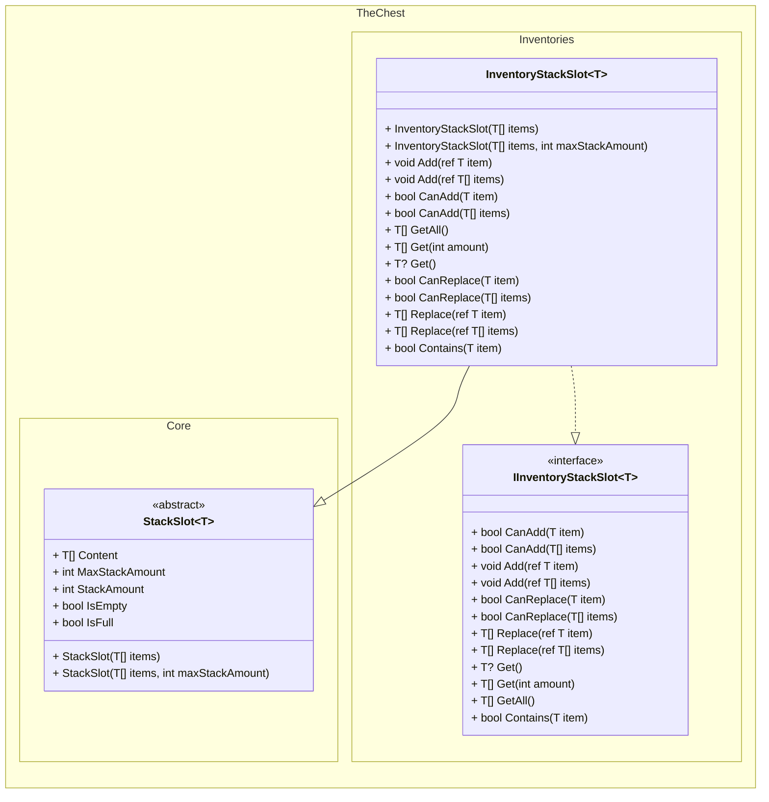

# Class Diagrams

This document contains class diagrams for the components of TheChest.Inventory project.

## Inventories

### Inventory Diagram
The `Inventory` class is a container that holds and manages items in slots.

### Stack Inventory Diagram
The `StackInventory` class is a generic container that holds and manages items in slots that can hold more than one amount of the same type.

### Lazy Stack Inventory Diagram
The `LazyStackInventory` class is a generic container that holds and manages items in slots that can hold more than one amount of the same type, but stores only one entity.

## Slots

### InventorySlot Diagram
The `InventorySlot` class can hold and manage a single item inside it.

### InventoryStackSlot Diagram
The `InventoryStackSlot` class can hold and manage a list of the same items inside it.

### Inventory Lazy Stack Slot Diagram
The `InventoryLazyStackSlot` class can hold and manage a single item inside it, but can also hold more than one amount of the same type.

