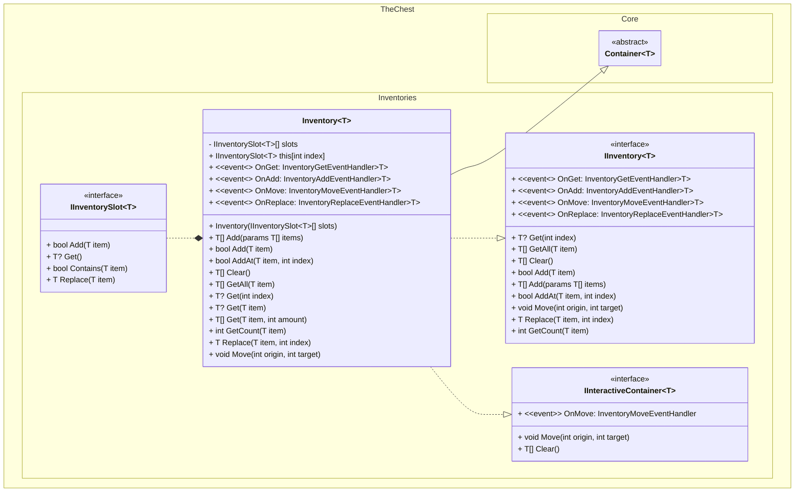
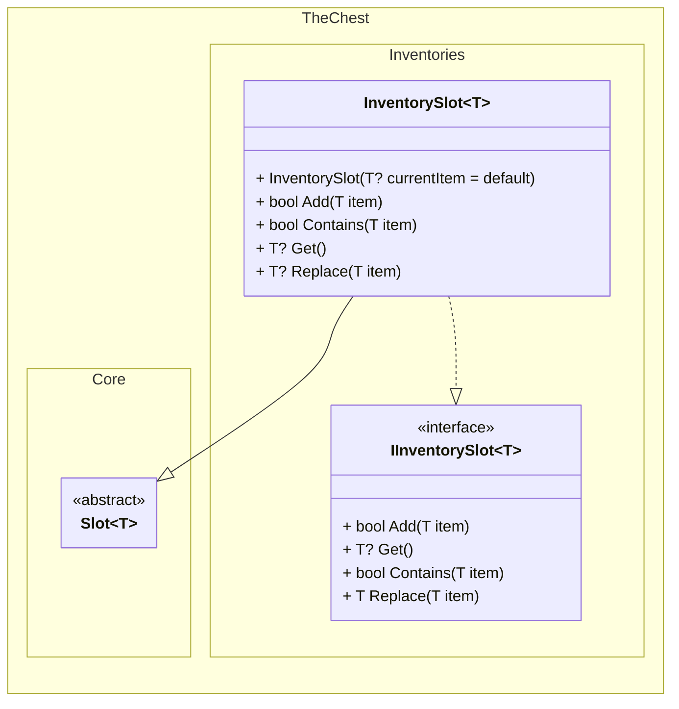

# Inventory Diagram
The `Inventory` class is a container that holds and manages items in slots.

```mermaid
---
config:
  theme: mc
  look: classic
  class:
    hideEmptyMembersBox: true
---
classDiagram
direction TB
	namespace TheChest.Core {
        class Container~T~ {
        }
	}
	namespace TheChest.Inventories {
        class IInventory~T~ {
	        + ~~event~~ OnGet: InventoryGetEventHandler~T~ 
	        + ~~event~~ OnAdd: InventoryAddEventHandler~T~ 
	        + ~~event~~ OnMove: InventoryMoveEventHandler~T~ 
	        + ~~event~~ OnReplace: InventoryReplaceEventHandler~T~ 
            + T? Get(int index)
	        + T[] GetAll(T item)
	        + T[] Clear()
	        + bool Add(T item)
	        + T[] Add(params T[] items)
	        + bool AddAt(T item, int index)
	        + void Move(int origin, int target)
	        + T Replace(T item, int index)
	        + int GetCount(T item)
        }
        class IInventorySlot~T~ {
	        + bool Add(T item)
	        + T? Get()
	        + bool Contains(T item)
	        + T Replace(T item)
        }
        class Inventory~T~ {
	        - IInventorySlot~T~[] slots
	        + IInventorySlot~T~ this[int index]
	        + ~~event~~ OnGet: InventoryGetEventHandler~T~ 
	        + ~~event~~ OnAdd: InventoryAddEventHandler~T~ 
	        + ~~event~~ OnMove: InventoryMoveEventHandler~T~ 
	        + ~~event~~ OnReplace: InventoryReplaceEventHandler~T~ 
	        + Inventory(IInventorySlot~T~[] slots)
            + T[] Add(params T[] items)
	        + bool Add(T item)
	        + bool AddAt(T item, int index)
	        + T[] Clear()
	        + T[] GetAll(T item)
	        + T? Get(int index)
	        + T? Get(T item)
	        + T[] Get(T item, int amount)
	        + int GetCount(T item)
	        + T Replace(T item, int index)
	        + void Move(int origin, int target)
        }
        class IInteractiveContainer~T~{
	        + ~~event~~ OnMove: InventoryMoveEventHandler 
            + void Move(int origin, int target)
            + T[] Clear()
        } 
	}

	<<abstract>> Container
	<<interface>> IInventory
	<<interface>> IInventorySlot
	<<interface>> IInteractiveContainer

    Inventory --|> Container
    Inventory ..|> IInventory
    Inventory ..|> IInteractiveContainer
    IInventorySlot ..* Inventory
```

## InventorySlot Diagram
The `InventorySlot` class can hold and manage a single item inside it.

```mermaid
---
config:
  theme: mc
  look: classic
  class:
    hideEmptyMembersBox: true
---
classDiagram
direction BT

namespace TheChest.Core {
    class Slot~T~ {
    }
}
<<abstract>> Slot

namespace TheChest.Inventories {
    class IInventorySlot~T~ {
        + bool Add(T item)
        + T? Get()
        + bool Contains(T item)
        + T Replace(T item)
    }
    class InventorySlot~T~ {
        + InventorySlot(T? currentItem = default)
        + bool Add(T item)
        + bool Contains(T item)
        + T? Get()
        + T? Replace(T item)
    }
}

<<interface>> IInventorySlot

InventorySlot~T~ --|> Slot~T~ 
InventorySlot~T~ ..|> IInventorySlot~T~
```
