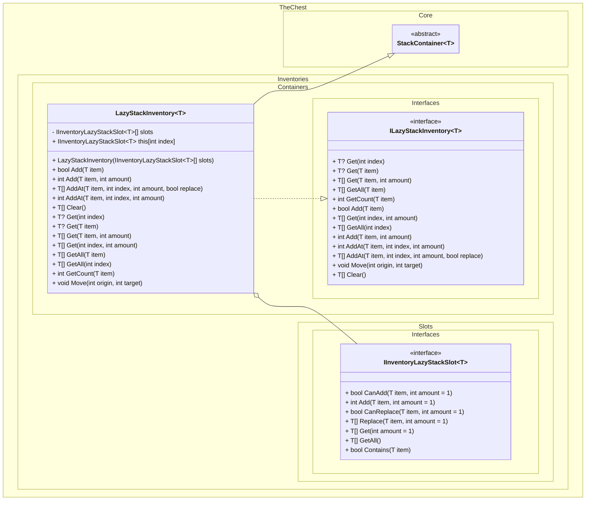
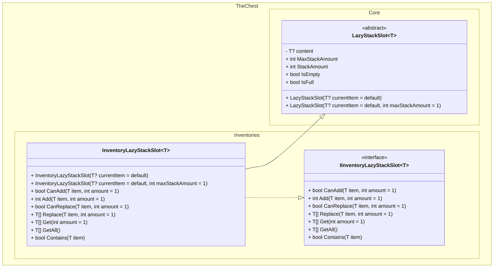

# Lazy Stack Inventory Diagram
The `LazyStackInventory` class is a generic container that holds and manages items in slots that can hold more than one amount of the same type, but stores only one entity.

## Inventory Lazy Stack Slot Diagram
The `InventoryLazyStackSlot` class can hold and manage a single item inside it, but can also hold more than one amount of the same type.

