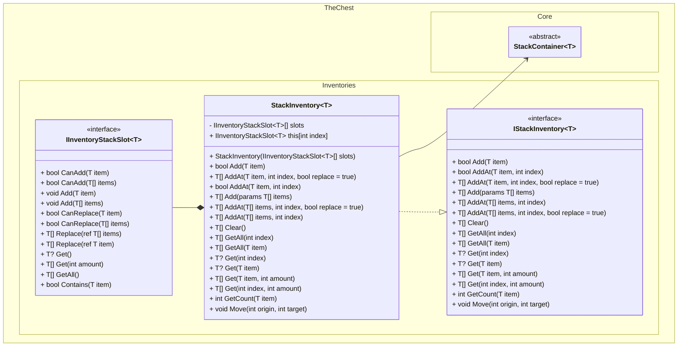
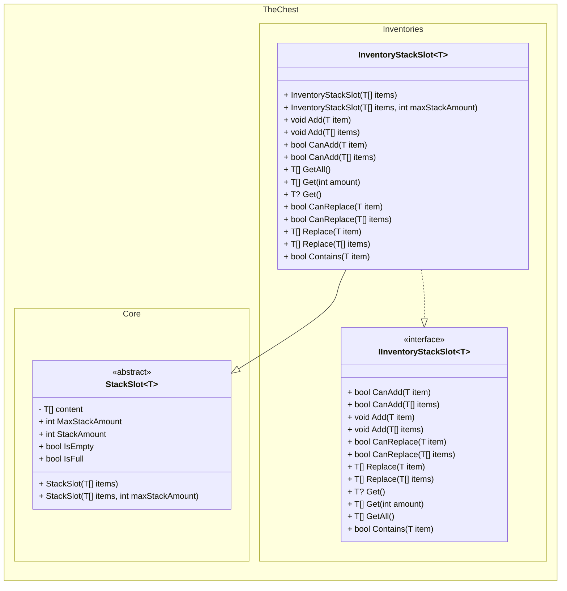

# Stack Inventory Diagram
The `StackInventory` class is a generic container that holds and manages items in slots that can hold more than one amount of the same type.

## InventoryStackSlot Diagram
The `InventoryStackSlot` class can hold and manage a list of the same items inside it.

